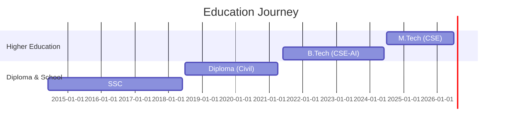
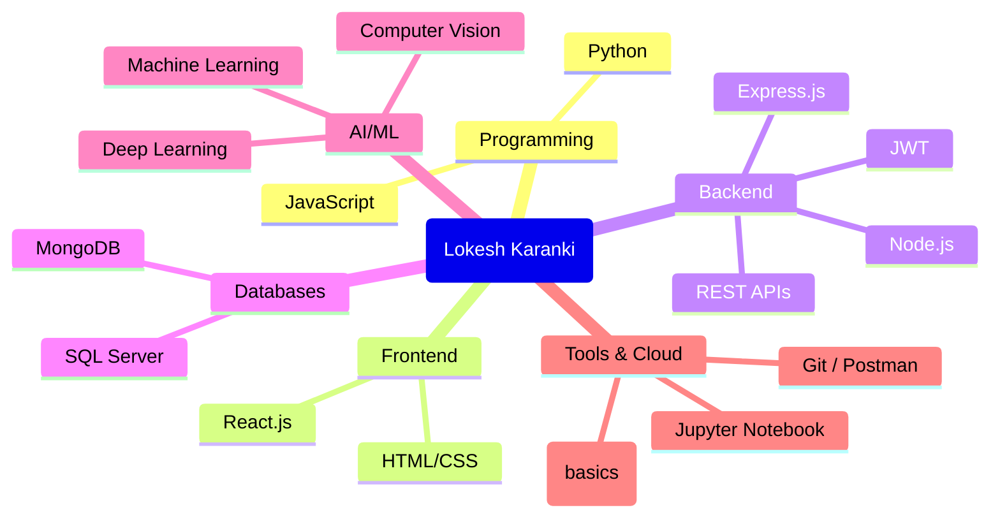
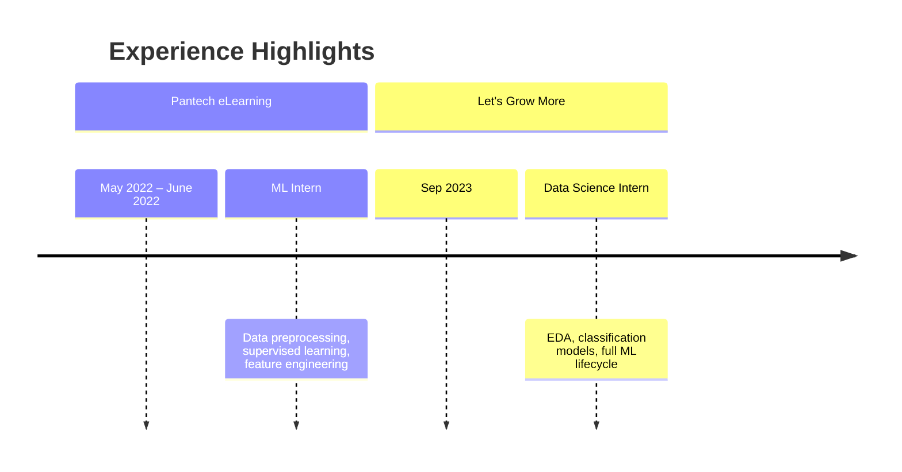
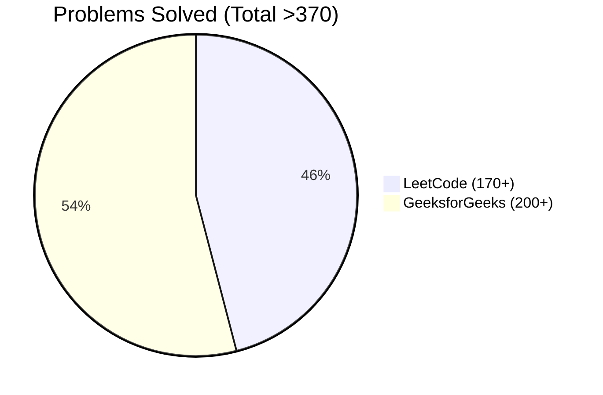
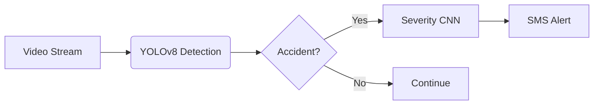

<!--
  README.md for Lokesh Karanki's GitHub Profile
  Fully static with embedded mermaid visualizations – no external APIs.
-->

# 👨‍💻 Lokesh Karanki

**Full Stack Developer | AI/ML Enthusiast | Researcher**

---

## 📌 Professional Summary

> Full Stack Developer with strong foundations in backend development, APIs, and AI‑powered applications.  
> Experienced in building end‑to‑end systems integrating machine learning models with real‑time applications.  
> Proficient in **JavaScript, Python, REST APIs, MongoDB** and growing expertise in **ASP.NET, SQL Server**.  
> Passionate about intelligent, high‑performance applications aligned with modern cloud and DevOps practices.

---

## 🎓 Education Timeline

| Degree | Institution | Year | CGPA |
|--------|-------------|------|------|
| **M.Tech (CSE)** | Madanapalle Institute of Technology & Science | 2024–2026 | 8.38/10 |
| **B.Tech (CSE - AI)** | Madanapalle Institute of Technology & Science | 2021–2024 | 7.54/10 |
| **Diploma (Civil)** | Sree Venkateswara College of Engineering | 2018–2021 | 8.48/10 |
| **SSC** | Arunodaya James Memorial High School | 2014–2018 | 8.20/10 |

---

## 🧠 Technical Skills – Mindmap

### Skill Proficiency (Self‑assessed)

| Category | Proficiency |
|----------|-------------|
| Python   | ████████░░ 80% |
| JavaScript | ████████░░ 80% |
| React.js | ██████░░░░ 65% |
| Node.js  | ███████░░░ 70% |
| MongoDB  | ████████░░ 75% |
| ML/DL    | ███████░░░ 72% |
| SQL      | ██████░░░░ 60% |

---

## 💼 Work Experience

---

## 📊 Problem Solving & Achievements

- ✅ **LeetCode** – 170+ problems  
- ✅ **GeeksforGeeks** – 200+ problems  
- ✅ **Scopus‑indexed papers** – 5 published  

---

## 📄 Research Publications (Scopus Indexed)

| # | Title | Conference/Journal | Year |
|---|-------|-------------------|------|
| 1 | Comparative Analysis of Deep Learning Architectures for Image Classification in Gastric Cancer Detection | Recent Advances in Computational Methods in Science and Technology | 2026 |
| 2 | Comorbidity Forecasting in Asthma: A Multimodal Learning Approach with Clinical and Environmental Data | Recent Advances in Computational Methods in Science and Technology | 2026 |
| 3 | Audio Forgery Alert: Uncovering Artificial Audio with Deepfake Detection | Grenze International Journal of Engineering & Technology (GIJET) | 2024 |

> 📌 *Two additional Scopus papers not listed here – total of 5.*

---

## 🚀 Featured Projects

### 🚗 Real-Time Accident Detection & Severity Classification
> **YOLOv8n, YOLOv8s, CNN, OpenCV, Python**  
- Fine‑tuned YOLOv8 models on 15k+ annotated images → **98% precision (v8s)**  
- CNN‑based severity classifier (Moderate / Severe)  
- End‑to‑end pipeline: detection → classification → **automated SMS alert**  

### 📝 Full Stack To‑Do Application with Auth
> **React.js, Node.js, Express.js, MongoDB, JWT**  
- Secure JWT authentication + RESTful CRUD APIs  
- Responsive UI with state management  

### ✍️ Handwritten Character Recognition
> **TensorFlow, Keras, NumPy**  
- Custom lightweight CNN (138K params) – **92.72% validation accuracy**  
- Trained on 425k grayscale images (47 classes)  
- Optimized `tf.data` pipeline with augmentation & LR scheduling  

---

## 📜 Certifications

| Certification | Issuer |
|---------------|--------|
| Python Certification | WebWiz Computer Education |
| Machine Learning Certification | Udemy |

---

## 🔗 Let's Connect

- 📧 **Email**: lokesh95159@gmail.com  
- 📱 **Phone**: +91 95159 74503  
- 🌍 **Location**: Madanapalle, India  
- 💼 **LinkedIn**: [linkedin.com/in/lokesh-karanki](https://linkedin.com/in/lokesh-karanki)  
- 🐙 **GitHub**: [github.com/lokeshkaranki](https://github.com/lokeshkaranki)  
- 🎓 **Google Scholar**: [View Profile](https://scholar.google.com/citations?user=your_id)

---

*Last updated: March 2026 – based on latest resume.*
